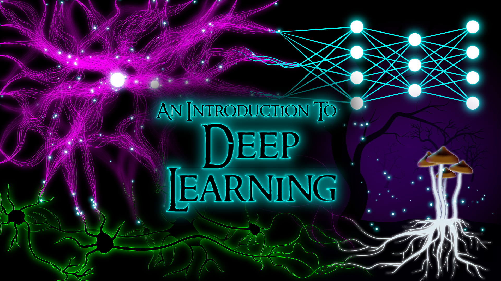

# CSE 490 G1 / 599 G1 Homework Solution

---

- [x] [**Homework 0: Fully Connected Networks**](./dl-hw0/README.md)
- [x] [**Homework 1: Convolutional Networks**](./dl-hw1/README.md)
- [ ] [**Homework 2: Batch Norm and Language Modeling**](./dl-hw2/README.md)
- [ ] [**Homework 3: Reinforcement Learning**](./rl-hw/README.md)

---

[An Introduction to Deep Learning - University of Washington, Autumn 2018](https://courses.cs.washington.edu/courses/cse599g1/18au/)

